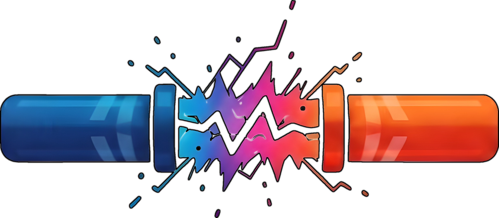

# Artifact Conduit (ARC)

Project ARC is an open-source system to bring a variety of artifact types into air-gapped environments.
It acts as a gateway to get artifacts from one zone to another while scans assure that only artifacts that match certain policies are transported.
These scans include malware, CVE, license scans including validation of signatures and the attestation of that process.

 

## Features of the ARC suite

### Procurement of artifacts from various sources

#### Sources

- OCI Registries
  - Container Images
  - Helm Charts
  - OCM Packages (see [Open Component Model](https://ocm.software/))
- Helm Repositories
- S3 compatible (MinIO), Google Cloud Storage, Azure Blob Storage, AWS S3
- HTTP(S)-GET

### Management of source and destination endpoints

- Define responsible contact for endpoints, be it
  - the owner of the endpoint itself
  - the owner of the endpoint configuration in ARC
- Shared endpoints
  - Endpoint is available globally within the instance of ARC for any tenant
- Expiry for endpoints to represent contract term
- Policies for valid endpoints for administrators (blocklist/allowlist)

### Validation, Malware & CVE scans

- Validate signatures
- Plugin system to allow to scanning artifacts with external scanners, e.g. Trivy, Sysdig, ClamAV,...
- Attestation of scan / signing
- License scanning
  
### Transport

- After a successful scan/policy evaluation the artifacts are delivered to one or more destinations.
- Dry-run functionality skipping the delivery to destinations

### Several ways to order artifacts

- One Shot
  - Order a specific version of an artifact
- Watcher
  - Order using semver definition to order current and future versions matching a given definition
- Mirror
  - Mirror a complete registry with all it's contents

### Deduplication and retirement

- Do not transport/scan the same resource twice if not necessary (CVE DB updated)
- Resources are not forever, so orders should not be forever too
  - TTL for orders

## To start developing

> ⚠️ Before contributing, make sure you read the [contribution guidelines](docs/development/contribution.md)

Please see our documentation in the [`/docs`](docs) folder for more details.

## Contributing

We'd love to get feedback from you. Please report bugs, suggestions or post questions by opening an issue.

## License

[Apache-2.0](LICENSE)
