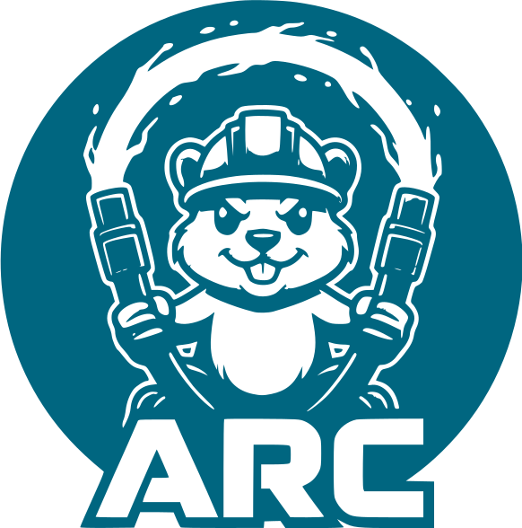

# Artifact Conduit (ARC)

ARC (Artifact Conduit) is an open-source system that acts as a gateway for procuring various artifact types and transferring them across security zones while ensuring policy compliance through automated scanning and validation. The system addresses the challenge of bringing external artifacts — container images, Helm charts, software packages, and other resources — into restricted environments where direct internet access is prohibited.

 

## Primary Goals

- **Artifact Procurement**: Pull artifacts from diverse sources including OCI registries, Helm repositories, S3-compatible storage, and HTTP endpoints
- **Security Validation**: Perform malware scanning, CVE analysis, license verification, and signature validation before artifact transfer
- **Policy Enforcement**: Ensure only artifacts meeting defined security and compliance policies cross security boundaries
- **Declarative Management**: Leverage Kubernetes-native declarative configuration for artifact lifecycle management
- **Auditability**: Provide attestation and traceability of all artifact processing operations

**Out of Scope:** ARC does not replace existing registry solutions or artifact repositories. It functions as an orchestration layer that coordinates artifact transfer and validation between existing infrastructure components.

For detailed information have a look at [`/docs`](docs) or the live documentation on [ARC Docs](https://arc.opendefense.cloud/).

## To start developing

> ⚠️ Before contributing, make sure you read the [contribution guidelines](docs/developer-guide/contributing.md)

Please see our documentation in the [`/docs`](docs) folder for more details.
The hosted version of the documentation can be found at <https://arc.opendefense.cloud/>.

## Contributing

We'd love to get feedback from you. Please report bugs, suggestions or post questions by opening an issue.

## License

[Apache-2.0](LICENSE)
