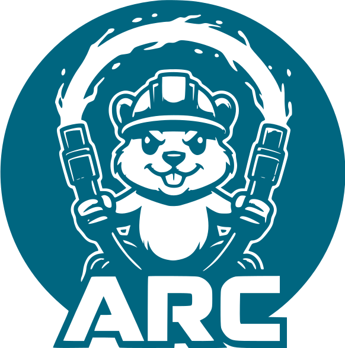

# Artifact Conduit (ARC)

<!-- overview-start -->
ARC (Artifact Conduit) is an open-source, Kubernetes-native orchestration layer for moving artifacts — container images, Helm charts, software packages, and other resources — from external sources into restricted environments where direct internet access is prohibited. An `Order` declares which artifacts to transfer; ARC resolves the referenced endpoints and credentials and runs an operator-authored [Argo Workflows](https://argo-workflows.readthedocs.io/en/stable/) template for each artifact.
<!-- overview-end -->

 

<!-- capabilities-start -->
## What ARC provides

- **Declarative API**: `Order`, `Endpoint`, and `ArtifactType` resources, managed with `kubectl` or GitOps
- **Endpoint and credential handling**: Reusable source and destination endpoints with referenced credentials, usage constraints, and [reachability probing](docs/user-guide/core-concepts.md#status)
- **Validation**: `Order`s are checked on admission and against endpoint and `ArtifactType` rules before any workflow runs
- **Idempotency**: Each artifact is identified by a hash of its definition, so unchanged artifacts are not re-run and changed ones get a new workflow
- **Orchestration**: One workflow per artifact, which ARC creates, tracks, [schedules](docs/operator-manual/cron-orders.md), and [cleans up](docs/operator-manual/ttl-based-cleanup.md)
- **Aggregated status**: Per-artifact progress reported in the `Order` status, plus [Prometheus metrics](docs/operator-manual/observability.md)
- **Custom artifact types**: Operators define `ArtifactType`s, each bound to a workflow template and [parameters](docs/operator-manual/workflow-parameters.md)

## What ARC enables operators to build

Pulling, scanning, verifying, and pushing artifacts happen entirely inside the Argo workflow template an `ArtifactType` references, which operators author. ARC passes the template its parameters and the endpoint credentials as workflow volumes; the template defines all artifact handling, for example:

- Pulling from OCI registries, Helm repositories, S3-compatible storage, or HTTP endpoints
- Malware scanning, CVE analysis, license checks, and signature verification
- Blocking transfer of artifacts that fail security and compliance policies
- Producing attestations or reports as workflow outputs

> **ARC ships no workflow templates.** The templates in the [`examples` directory](https://github.com/opendefensecloud/artifact-conduit/tree/main/examples) illustrate the integration and are not production-ready. See [Extending Artifact Types](docs/operator-manual/extending-artifact-types.md) for writing custom templates.

**Out of Scope:** ARC does not replace existing registry solutions or artifact repositories, nor does it implement transfer or scanning logic itself. It coordinates artifact transfer between existing infrastructure components through operator-authored workflow templates.
<!-- capabilities-end -->

For detailed information have a look at [`/docs`](docs) or the live documentation on [ARC Docs](https://arc.opendefense.cloud/).

## To start developing

> ⚠️ Before contributing, make sure you read the [contribution guidelines](docs/CONTRIBUTING.md)

Please see our documentation in the [`/docs`](docs) folder for more details.
The hosted version of the documentation can be found at <https://arc.opendefense.cloud/>.

## Contributing

We'd love to get feedback from you. See the [Contributing Guide](docs/CONTRIBUTING.md) for how to [report bugs, suggestions, questions and security vulnerabilities](docs/CONTRIBUTING.md#how-to-provide-feedback) and for our development workflow. Everyone participating is expected to follow our [Code of Conduct](docs/CODE_OF_CONDUCT.md).

## License

[Apache-2.0](LICENSE)
