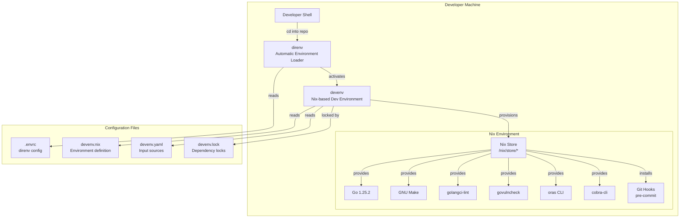

# Contributing

## How To Provide Feedback

Please [raise an issue in Github](https://github.com/opendefensecloud/artifact-conduit/issues).

## Code of Conduct

See [Code of Conduct](./CODE_OF_CONDUCT.md).

## Community Meetings (monthly)

There are currently no community meetings. Please raise an issue to reach out.

## Contributor Meetings (twice monthly)

There are currently no public contributor meetings. Please raise an issue to reach out.

## Slack

There is currently no public Slack. Please raise an issue to reach out.

## Roles

The Argo project currently has 4 designated [roles](https://github.com/argoproj/argoproj/blob/main/community/membership.md):

* Member
* Reviewer
* Approver
* Lead

The Reviewer and Approver roles can optionally be scoped to an area of the code base (for example, UI or docs).

Current roles for Reviewers and above can be found in [OWNERS](https://github.com/opendefensecloud/artifact-conduit/blob/main/OWNERS).

If you are interested in formally joining the Argo project, [create a Membership request](https://github.com/argoproj/argoproj/issues/new?template=membership.md&title=REQUEST%3A%20New%20membership%20for%20%3Cyour-GH-handle%3E) in the [argoproj](https://github.com/argoproj/argoproj) repository as described in the [Membership](https://github.com/argoproj/argoproj/blob/main/community/membership.md) guide.

## How To Contribute

We're always looking for contributors.

### Authoring PRs

* Documentation - something missing or unclear? Please submit a pull request according to our [docs contribution guide](doc-changes.md)!
* Code contribution - investigate a [good first issue](https://github.com/opendefensecloud/artifact-conduit/issues?q=is%3Aopen+is%3Aissue+label%3A%22good+first+issue%22), [high priority bugs](#triaging-bugs), or anything not assigned.
* You can work on an issue without being assigned.

#### Contributor Workshop

Please check out the following resources if you are interested in contributing:

* [90m hands-on contributor workshop](https://youtu.be/zZv0lNCDG9w).
* [Deep-dive into components and hands-on experiments](https://docs.google.com/presentation/d/1IU0a3unnr3tBRi38Zn3EHQZj3z6yvocfG9x9icRu1LE/edit?usp=sharing).
* [Architecture overview](https://github.com/opendefensecloud/artifact-conduit/blob/main/docs/architecture.md).

#### Running Locally

To run Argo Workflows locally for development: [running locally](running-locally.md).

#### Committing

See the [Committing Guidelines](running-locally.md#committing).

#### Dependencies

Dependencies increase the risk of security issues and have on-going maintenance costs.

The dependency must pass these test:

* A strong use case.
* It has an acceptable license (e.g. MIT).
* It is actively maintained.
* It has no security issues.

Example, should we add `fasttemplate`, [view the Snyk report](https://snyk.io/advisor/golang/github.com/valyala/fasttemplate):

| Test                                    | Outcome                             |
|-----------------------------------------|-------------------------------------|
| A strong use case.                      | ❌ Fail. We can use `text/template`. |
| It has an acceptable license (e.g. MIT) | ✅ Pass. MIT license.               |
| It is actively maintained.              | ❌ Fail. Project is inactive.        |
| It has no security issues.              | ✅ Pass. No known security issues.  |

No, we should not add that dependency.

#### Test Policy

Changes without either unit or e2e tests are unlikely to be accepted.
See [the pull request template](https://github.com/opendefensecloud/artifact-conduit/blob/main/.github/pull_request_template.md).

### Other Contributions

* [Reviewing PRs](#reviewing-prs)
* Responding to questions in the [Slack](#slack) channels
* Responding to questions in [Github Discussions](https://github.com/opendefensecloud/artifact-conduit/discussions)
* [Triaging new bugs](#triaging-bugs)

#### Reviewing PRs

Anybody can review a PR.
If you are in a [designated role](#roles), add yourself as an "Assignee" to a PR if you plan to lead the review.
If you are a Reviewer or below, then once you have approved a PR, request a review from one or more Approvers and above.

#### Timeliness

We encourage PR authors and reviewers to respond to change requests in a reasonable time frame.
If you're on vacation or will be unavailable, please let others know on the PR.

##### PR Author Timeliness

If a PR hasn't seen activity from the author for 10 business days, someone else may ask to take it over.
We suggest commenting on the original PR and tagging the author to check on their plans.
Maintainers can reassign PRs to new contributors if the original author doesn't respond with a plan.
For PRs that have been inactive for 3 months, the takeover process can happen immediately.
**IMPORTANT:** If a PR is taken over and uses any code from the previous PR, the original author *must* be credited using `Co-authored-by` on the commits.

#### Triaging Bugs

New bugs need to be triaged to identify the highest priority ones.
Any Member can triage bugs.

Apply the labels `P0`, `P1`, `P2`, and `P3`, where `P0` is highest priority and needs immediate attention, followed by `P1`, `P2`, and then `P3`.
If there's a new `P0` bug, notify the [`#argo-wf-contributors`](https://cloud-native.slack.com/archives/C0510EUH90V) Slack channel.

Any bugs with >= 5 "👍" reactions should be labeled at least `P1`.
Any bugs with 3-4 "👍" reactions should be labeled at least `P2`.
Bugs can be [sorted by "👍"](https://github.com/opendefensecloud/artifact-conduit/issues?q=is%3Aissue+is%3Aopen+sort%3Areactions-%2B1-desc+label%3Atype%2Fbug).

If the issue is determined to be a user error and not a bug, remove the `type/bug` label (and the `type/regression` label, if applicable) and replace it with the `type/support` label.
If more information is needed from the author to diagnose the issue, then apply the `problem/more information needed` label.

##### Staleness

Only issues and PRs that have the [`problem/more information needed` label](https://github.com/opendefensecloud/artifact-conduit/labels/problem%2Fmore%20information%20needed) will be considered for staleness.

If the author does not respond timely to a request for more information, the issue or PR will be automatically marked with the `problem/stale` label and a bot message.
Subsequently, if there is still no response, it will be automatically closed as "not planned".

See the [Stale Action configuration](https://github.com/opendefensecloud/artifact-conduit/blob/main/.github/workflows/stale.yaml) for more details.

## Automated actions

As a member (see [roles](https://github.com/argoproj/argoproj/blob/main/community/membership.md)) of the argo-project you can use the following comments on PRs to trigger actions:

* `/retest` - re-run any failing test cases

If your PR contains a bug fix, and you want to have that fix backported to a previous release branch, please label your PR with `cherry-pick/x.y` (example: `cherry-pick/3.1`).
If you do not have access to add labels, ask a maintainer to add them for you.

If you add labels before the PR is merged, the cherry-pick bot will open the backport PRs when your PR is merged.

Adding a label after the PR is merged will also cause the bot to open the backport PR.

## Get involved

Argo Workflows is seeking more community involvement and ultimately more [Reviewers and Approvers](https://github.com/argoproj/argoproj/blob/main/community/membership.md) to help keep it viable.

### Where is help needed?

Help is needed for:

* [reviewing PRs](#reviewing-prs)
* [triaging](#triaging-bugs) new bugs by prioritizing them with `P0`, `P1`, `P2`, and `P3` labels
* responding to questions in [Github Discussions](https://github.com/opendefensecloud/artifact-conduit/discussions)
* responding to questions in [CNCF Slack](https://argoproj.github.io/community/join-slack) in the `#argo-workflows` and `#argo-wf-contributors` channels
* releasing new versions

# Running locally

This guide provides technical information for developers contributing to the Artifact Conduit (ARC) project. It covers the development workflow, build system, code organization, and common development tasks. For detailed information about specific topics, see the referenced sections.

## Development Environment Architecture

The ARC project uses a declarative, reproducible development environment based on Nix. This approach ensures that all developers work with identical tool versions and configurations, eliminating "works on my machine" issues.



**Environment Loading Flow**: When a developer navigates into the repository directory, `direnv` automatically detects the `.envrc` file and activates the `devenv` environment, which provisions all required tools from the Nix store.

## Prerequisites

Before setting up the ARC development environment, ensure the following software is installed on your system:

| Requirement             | Purpose                                                 | Minimum Version |
| ----------------------- | ------------------------------------------------------- | --------------- |
| **Nix Package Manager** | Provides reproducible package management                | 2.3+            |
| **direnv**              | Automatically loads environment when entering directory | 2.20+           |
| **Git**                 | Version control (provided by Nix if needed)             | 2.0+            |

## Development Workflow Overview

ARC follows a **code-generation-heavy pattern** typical in Kubernetes ecosystem projects. Changes to API types trigger code regeneration, which produces client libraries, OpenAPI specifications, and CRD manifests.

***

## Build System

The ARC build system uses a Makefile to orchestrate various tools, designed for reproducibility. All required tools are provided in the `bin/` directory.

| Target           | Purpose                                | Key Tools Used                              |
| ---------------- | -------------------------------------- | ------------------------------------------- |
| `make codegen`   | Generate client-go libraries & OpenAPI | `openapi-gen`, `kube_codegen.sh`            |
| `make manifests` | Generate CRDs and RBAC manifests       | `controller-gen`                            |
| `make fmt`       | Format code, add license headers       | `addlicense`, `go fmt`                      |
| `make lint`      | Run linters and checks                 | `golangci-lint`, `shellcheck`, `addlicense` |
| `make test`      | Run all tests with coverage            | `ginkgo`, `setup-envtest`                   |
| `make clean`     | Remove generated binaries              | -                                           |

### Tool Versions

The system **pins specific tool versions** for reproducibility:

- BDD testing framework: `v2.27.2`
- Go linter: `v2.5.0`
- CRD/RBAC generator: `v0.19.0`
- Kubernetes test API server: `release-0.22`
- K8s for integration tests: `1.34.1`

***

## Codebase Organization

ARC codebase follows standard Kubernetes project conventions:

| Directory           | Purpose                                 | Generated/Manual |
| ------------------- | --------------------------------------- | ---------------- |
| `api/arc/v1alpha1/` | Custom resource type definitions        | Manual           |
| `client-go/`        | Client libraries for ARC resources      | Generated        |
| `pkg/apiserver/`    | Extension API server implementation     | Manual           |
| `pkg/controller/`   | Controller reconciliation logic         | Manual           |
| `pkg/registry/`     | Storage strategies for custom resources | Manual           |
| `config/`           | Kubernetes manifests (CRDs, RBAC)       | Generated        |
| `hack/`             | Build and code generation scripts       | Manual           |

***

## Code Generation Process

ARC uses the Kubernetes code-generator to produce client libraries and OpenAPI specs.

- `make codegen` triggers `hack/update-codegen.sh`
- Generates:
  - Client-go libraries in `client-go/`
  - OpenAPI specs
  - CRD manifests

See Client Libraries section for usage details.

***

## Testing Strategy

ARC uses a multi-layered testing strategy:

- **Unit Tests**
- **Integration Tests** (uses `ENVTEST_K8S_VERSION=1.34.1`)
- **Controller Tests** via envtest
- **E2E Tests** using local `kind` cluster via `make test-e2e`

Run all tests and generate coverage:

```sh
make test
```

Run specific tests:

```sh
make testargs="./pkg/controller" test
# run them verbose
make testargs="-v ./pkg/controller" test
```

Test coverage is tracked using Coveralls.

***

## Continuous Integration (CI) Pipeline

Pipeline runs on every push and pull request, enforcing code quality and test coverage.

- **Lint Job**
  - `addlicense`
  - `shellcheck`
  - `golangci-lint`
- **Test Job** (runs after Lint)
  - `make test`

For customization details, see `.github/workflows/golang.yaml`.

***

## Adding a New Custom Resource

To introduce a new custom resource:

1. **Create type definition** in `api/arc/v1alpha1/`
2. **Regenerate code** via `make codegen`
3. **Implement apiserver-kit rest/object interfaces** in `api/arc` (check `*_rest.go` files for references)
4. **Add controller logic** in `pkg/controller/` if reconciliation is needed

See `hack/update-codegen.sh` for implementation details on code generation.

***

## Modifying Existing API Types

Typical steps:

1. Edit types in `api/arc/v1alpha1/`
2. Run `make codegen`
3. Run `make manifests`
4. Run `make test`

> **Note:** Breaking changes may affect existing clients. Follow semantic versioning and provide migration paths.

***

## Code Quality & Linting

Lint and license checks before committing:

- `addlicense` for Apache 2.0 headers
- `shellcheck` for scripts in `hack/`
- `golangci-lint` for Go linting

Fix issues with:

```sh
make fmt
make lint
```

***
