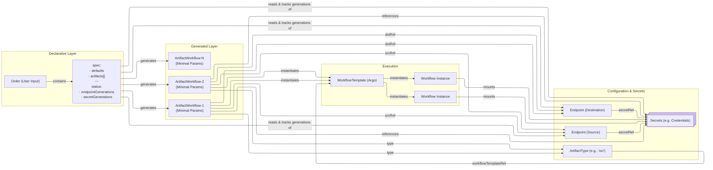
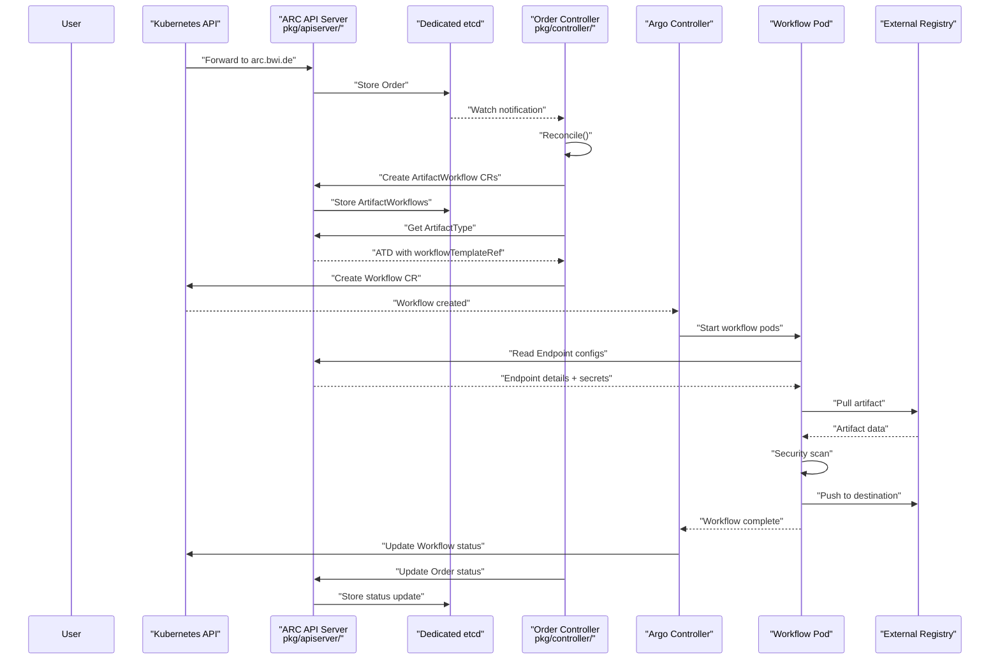

# What is Artifact Conduit (ARC)?

ARC (Artifact Conduit) is an open-source system that acts as a gateway for procuring various artifact types and transferring them across security zones while ensuring policy compliance through automated scanning and validation. The system addresses the challenge of bringing external artifacts—container images, Helm charts, software packages, and other resources—into restricted environments where direct internet access is prohibited.

**Primary Goals:**

- **Artifact Procurement**: Pull artifacts from diverse sources including OCI registries, Helm repositories, S3-compatible storage, and HTTP endpoints
- **Security Validation**: Perform malware scanning, CVE analysis, license verification, and signature validation before artifact transfer
- **Policy Enforcement**: Ensure only artifacts meeting defined security and compliance policies cross security boundaries
- **Declarative Management**: Leverage Kubernetes-native declarative configuration for artifact lifecycle management
- **Auditability**: Provide attestation and traceability of all artifact processing operations

**Out of Scope:** ARC does not replace existing registry solutions or artifact repositories. It functions as an orchestration layer that coordinates artifact transfer and validation between existing infrastructure components.

## System Architecture

ARC is implemented as a Kubernetes Extension API Server integrated with the Kubernetes API Aggregation Layer. This architectural approach provides several advantages over Custom Resource Definitions (CRDs), including dedicated storage isolation, custom API implementation flexibility, and reduced risk to the hosting cluster's control plane.

**Architecture: ARC System Components and Data Flow**

The system follows a layered architecture where users interact through the Kubernetes API, requests flow through the Kubernetes API aggregation layer to the ARC API Server, and the Order Controller orchestrates workflow execution by decomposing high-level Orders into executable ArtifactWorkflows.

## Core Concepts

ARC introduces four primary custom resource types under the `arc.bwi.de/v1alpha1` API group:

| Resource             | Purpose                                                                                    | Scope                            |
| -------------------- | ------------------------------------------------------------------------------------------ | -------------------------------- |
| **Order**            | Declares intent to procure one or more artifacts with shared configuration defaults        | User-facing, high-level          |
| **ArtifactWorkflow** | Represents a single artifact operation decomposed from an Order                            | System-generated, execution unit |
| **Endpoint**         | Defines a source or destination location with credentials                                  | Configuration, reusable          |
| **ArtifactType**     | Specifies processing rules and workflow templates for artifact types (e.g., "oci", "helm") | Configuration, system-wide       |

## Key Components

### ARC API Server

The ARC API Server is a Kubernetes Extension API Server implemented using the `k8s.io/apiserver` library. Key characteristics:

- **Implementation Path**: `pkg/apiserver/`
- **Storage Backend**: Dedicated etcd instance (isolated from Kubernetes control plane etcd)
- **Registry Pattern**: Uses `pkg/registry/` for custom storage strategies per resource type
- **API Group**: `arc.bwi.de` with version `v1alpha1`
- **Integration**: Registered with Kubernetes API Aggregation Layer to handle requests to `arc.bwi.de/*` paths

The dedicated etcd approach provides:

- Isolation from the hosting cluster's control plane
- Flexibility to change storage backends if needed
- Protection against resource volume impacting cluster stability

### Order Controller

The Order Controller implements the reconciliation loop for Order resources:

- **Implementation Path**: `pkg/controller/`
- **Framework**: Uses `sigs.k8s.io/controller-runtime` (version 0.22.4)
- **Reconciliation Logic**:

    1. Watch for Order create/update/delete events
    2. Validate endpoint references exist
    3. Apply defaults from Order.spec.defaults
    4. Generate ArtifactWorkflow resources (one per artifact entry)
    5. Lookup ArtifactType for each fragment's type
    6. Create Argo Workflow instances with appropriate WorkflowTemplate references
    7. Update Order status based on ArtifactWorkflow and Workflow statuses
    8. Handle finalizers for cleanup operations

