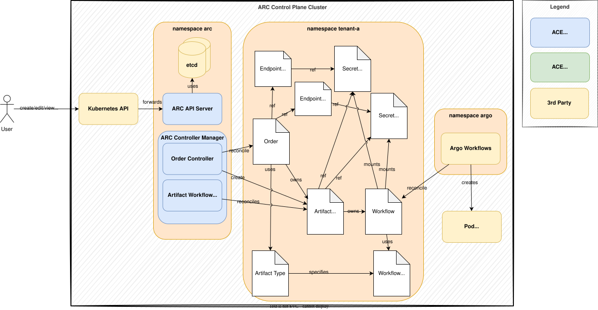
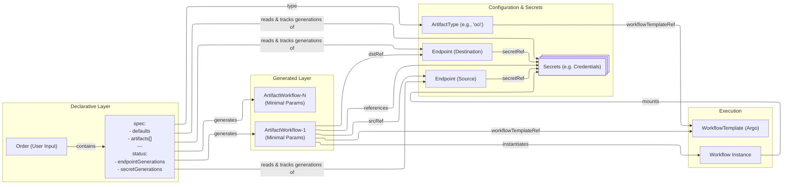

# What is Artifact Conduit (ARC)?

ARC (Artifact Conduit) is an open-source system that acts as a gateway for procuring various artifact types and transferring them across security zones while ensuring policy compliance through automated scanning and validation. The system addresses the challenge of bringing external artifacts—container images, Helm charts, software packages, and other resources—into restricted environments where direct internet access is prohibited.

**Primary Goals:**

- **Artifact Procurement**: Pull artifacts from diverse sources
- **Security Validation**: Perform malware scanning, CVE analysis, license verification, and signature validation before artifact transfer
- **Policy Enforcement**: Ensure only artifacts meeting defined security and compliance policies cross security boundaries
- **Declarative Management**: Leverage Kubernetes-native declarative configuration for artifact lifecycle management
- **Auditability**: Provide attestation and traceability of all artifact processing operations

**Out of Scope:** ARC does not replace existing registry solutions or artifact repositories. It functions as an orchestration layer that coordinates artifact transfer and validation between existing infrastructure components.

## System Architecture

ARC is implemented as a Kubernetes Extension API Server integrated with the Kubernetes API Aggregation Layer. This architectural approach provides several advantages over Custom Resource Definitions (CRDs), including dedicated storage isolation, custom API implementation flexibility, and reduced risk to the hosting cluster's control plane.

**Architecture: ARC System Components and Data Flow**

The system follows a layered architecture where users interact through the Kubernetes API, requests flow through the Kubernetes API aggregation layer to the ARC API Server, and the Order Controller orchestrates workflow execution by decomposing high-level Orders into executable ArtifactWorkflows.

ARC isn't a workflow engine itself but uses [Argo Workflows](https://argo-workflows.readthedocs.io/en/stable/) to orchestrate the workflows.
This enables operators to define and execute complex workflows without needing to write custom code.

## Core Concepts

ARC introduces four primary custom resource types under the `arc.bwi.de/v1alpha1` API group:

| Resource             | Purpose                                                                                    | Scope                            |
| -------------------- | ------------------------------------------------------------------------------------------ | -------------------------------- |
| **Order**            | Declares intent to procure one or more artifacts with shared configuration defaults        | User-facing, high-level          |
| **ArtifactWorkflow** | Represents a single artifact operation decomposed from an Order                            | System-generated, execution unit |
| **Endpoint**         | Defines a source or destination location with credentials                                  | Configuration, reusable          |
| **ArtifactType**     | Specifies processing rules and workflow templates for artifact types (e.g., "oci", "helm") | Configuration, system-wide       |

```mermaid
---
config:
  layout: elk
---
flowchart LR
 subgraph subGraph0["Declarative Layer"]
        Order["Order (User Input)"]
        Spec["spec:<br>- defaults<br>- artifacts[]<br>--- <br>status:<br>- endpointGenerations<br>- secretGenerations"]
  end
 subgraph subGraph1["Generated Layer"]
        ArtifactWorkflow1["ArtifactWorkflow-1<br>(Minimal Params)"]
        ArtifactWorkflowN["ArtifactWorkflow-N<br>(Minimal Params)"]
  end
 subgraph Configuration["Configuration & Secrets"]
        ArtifactTypeDef@{ label: "ArtifactType (e.g., 'oci')" }
        EndpointSrc["Endpoint (Source)"]
        EndpointDst["Endpoint (Destination)"]
        EndpointSecret@{ shape: procs, label: "Secrets (e.g. Credentials)"}
  end
 subgraph Execution["Execution"]
        WorkflowTemplate["WorkflowTemplate (Argo)"]
        WorkflowInstance1["Workflow Instance"]
  end
    Order -- contains --> Spec
    Spec -- generates --> ArtifactWorkflow1 & ArtifactWorkflowN
    Spec -- reads & tracks generations of --> EndpointSrc & EndpointDst & EndpointSecret
    Spec -- type --> ArtifactTypeDef
    ArtifactWorkflow1 -- srcRef --> EndpointSrc
    ArtifactWorkflow1 -- dstRef --> EndpointDst
    EndpointSrc -- secretRef --> EndpointSecret
    EndpointDst -- secretRef --> EndpointSecret
    ArtifactTypeDef -- workflowTemplateRef --> WorkflowTemplate
    ArtifactWorkflow1 -- references --> EndpointSecret
    ArtifactWorkflow1 -- instantiates --> WorkflowInstance1
    ArtifactWorkflow1 -- workflowTemplateRef --> WorkflowTemplate
    WorkflowInstance1 -- mounts --> EndpointSecret

    ArtifactTypeDef@{ shape: rect}
```
