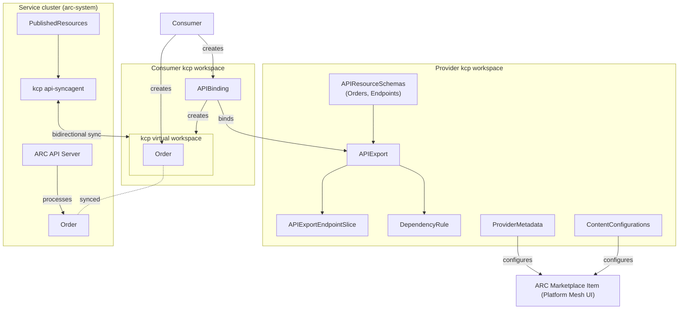

# Cloud API

This guide explains how to expose ARC APIs through [kcp][kcp-workspaces]
workspaces and the platform-mesh marketplace, allowing consumer workspaces to
create `Orders` and `Endpoints` without direct access to the ARC service cluster.

## Overview

The cloud-api integration layers kcp's [workspace model][kcp-workspaces] on top
of ARC's native Kubernetes API. A **provider workspace** holds the
[`APIExport`][kcp-apiexport], resource schemas, and marketplace UI assets. A
**sync agent** running on the service cluster bridges [virtual
workspaces][kcp-virtual-workspaces] with the real ARC API server, syncing
`Orders` and `Endpoints` bidirectionally. Consumer workspaces subscribe to the
export via the platform-mesh marketplace portal.

## Architecture



## Prerequisites

- A **kcp** instance with at least two workspaces (provider and consumer)
- **Flux CD** installed on the service cluster for sync agent deployment
- **platform-mesh** marketplace UI (optional, for the portal integration)

## Provider workspace

The provider workspace exposes ARC's `Orders` and `Endpoints` APIs to
consumers. All manifests live under [`assets/cloud-api/provider/`][provider]
and apply to the **provider kcp workspace**.

### API schemas and export

Apply the hand-authored [`APIResourceSchema`][kcp-apiresourceschema] resources,
the [`APIExport`][kcp-apiexport], and the
[`APIExportEndpointSlice`][kcp-apiexport]:

- `ars-orders.yaml` — Order schema
- `ars-endpoints.yaml` — Endpoint schema
- `apiexport.yaml` — Export with `PermissionClaims` for `Secrets`, `Namespaces`,
  `Events`, and `LogicalClusters`
- `apiexportendpointslice.yaml` — Populates [virtual-workspace][kcp-virtual-workspaces]
  URLs the sync agent connects to

!!! note

    The schemas are maintained in Git rather than generated by the sync agent's
    schema controller (which is intentionally disabled). Auto-generation from
    ARC's API fails because it contains unsupported fields that kcp cannot
    process. The hand-authored schemas are a workaround — see
    [artifact-conduit#442](https://github.com/opendefensecloud/artifact-conduit/issues/442)
    for progress toward fixing this.

A [`DependencyRule`][dep] (`dependencyrule-order-endpoint.yaml`) prevents
deletion of `Endpoints` while `Orders` still reference them via
`spec.defaults.srcRef`, `spec.defaults.dstRef`, `spec.artifact.srcRef`, or
`spec.artifact.dstRef`. The [dependency-controller][dep] must be installed for
`DependencyRule` resources to take effect.

### Binding RBAC

`apiexport-bind-rbac.yaml` grants the [`bind`][kcp-apiexport] verb on the
`arc.opendefense.cloud` APIExport to `system:authenticated`, enabling
marketplace binding.

### UI assets

The [`ui/`][provider-ui] directory contains platform-mesh manifests that
surface ARC in the marketplace portal:

- `providermetadata-arc.yaml` — [`ProviderMetadata`][pm-provider-metadata]
  tile (display name, description, icon, support links)
- `contentconfiguration-orders.yaml` — [`ContentConfiguration`][pm-content-configuration]
  for Orders (list, detail, and type-specific create modals)
- `contentconfiguration-endpoints.yaml` — [`ContentConfiguration`][pm-content-configuration]
  for Endpoints (list, detail, and create form)

## Sync agent deployment

The sync agent ([`syncagent/`][provider-sa]) runs on the service cluster.
All manifests in this section apply to the **service cluster** (`arc-system`).

### Flux deployment

A `HelmRelease` pulls the `api-syncagent` chart from the kcp Helm repository:

- `helmrelease.yaml` — HelmRelease targeting `arc-system`, chart version 0.6.0
- `helmrepository.yaml` — kcp Helm repo source

### Kubeconfig

`kcp-kubeconfig-secret.yaml` provides the kcp workspace connection. Populate
the `TODO` placeholders with the real kcp server URL, CA, and service account
token:

```yaml
clusters:
- cluster:
    certificate-authority-data: TODO  # base64-encoded CA
    server: https://TODO              # kcp server URL
users:
- name: syncagent
  user:
    token: TODO  # extract from arc-syncagent-token Secret
```

The kubeconfig must target the provider workspace (e.g. `root:providers:odd`).

### RBAC and service account

`syncagent-serviceaccount.yaml` (in the [provider directory][provider]) creates
a `ServiceAccount`, token `Secret`, and least-privilege `ClusterRole`/`ClusterRoleBinding`
in the kcp provider workspace. Supplemental RBAC in `rbac.yaml` grants access to ARC resources and
secrets beyond what the Helm chart provides.

### PublishedResources

Two [`PublishedResource`][kcp-syncagent] objects define sync behavior:

- `publishedresource-orders.yaml` — Bidirectional sync for Orders. Handles
  field promotion, endpoint ref rewriting, and status derivation via CEL
  mutations.
- `publishedresource-endpoints.yaml` — Down-sync for Endpoints. Handles
  secret-ref rewriting and related credential `Secret` sync.

Object names are prefixed with `<ClusterName>-<namespace>-<name>` to prevent
collisions when multiple consumers sync into the same namespace.

!!! note

    The CEL mutations are workarounds for upstream limitations — see
    [artifact-conduit#442](https://github.com/opendefensecloud/artifact-conduit/issues/442).
    The schema controller and export controller are disabled because they
    produce non-reproducible output; schemas and exports are maintained as
    plain Git-managed manifests.

## Consumer workspace

[`assets/cloud-api/consumer/`][consumer] contains an
[`APIBinding`][kcp-apibinding] which binds the [`APIExport`][kcp-apiexport] and
accepts `PermissionClaims` for `Secrets`, `Namespaces`, `Events`, and
`LogicalClusters`. Apply to the **consumer kcp workspace**. Consumers typically
subscribe through the marketplace portal ("enable" button) rather than applying
this manifest directly.

[kcp-workspaces]: https://docs.kcp.io/kcp/latest/concepts/workspaces/
[kcp-virtual-workspaces]: https://docs.kcp.io/kcp/latest/concepts/workspaces/virtual-workspaces/
[kcp-apiexport]: https://docs.kcp.io/kcp/latest/reference/apis/apiexport/
[kcp-apibinding]: https://docs.kcp.io/kcp/latest/reference/apis/apibinding/
[kcp-apiresourceschema]: https://docs.kcp.io/kcp/latest/reference/apis/apiresourceschema/
[kcp-syncagent]: https://github.com/kcp-dev/api-syncagent
[pm-provider-metadata]: https://platform-mesh.io/reference/resources/provider-metadata.html
[pm-content-configuration]: https://platform-mesh.io/reference/resources/content-configuration.html
[provider]: ../../assets/cloud-api/provider/
[provider-ui]: ../../assets/cloud-api/provider/ui/
[provider-sa]: ../../assets/cloud-api/provider/syncagent/
[consumer]: ../../assets/cloud-api/consumer/
[dep]: https://github.com/opendefensecloud/dependency-controller
