# Workflow Config

ARC does not orchestrate the workflows, but relies on [Argo Workflows](https://github.com/argoproj/argo-workflows) as workflow engine.

## Resource Relationships

The following diagram illustrates how ARC resources work together to instantiate and configure Argo Workflows:

```mermaid
graph TB
    Order["📋 Order<br/>(User Request)"]
    ArtifactWorkflow["📦 ArtifactWorkflow"]
    ArtifactTypeDef["🏷️ ArtifactType"]
    SrcEndpoint["🔌 Endpoint (Source)"]
    DstEndpoint["🔌 Endpoint (Destination)"]
    SrcSecret["🔐 Secret<br/>(Source Credentials)"]
    DstSecret["🔐 Secret<br/>(Destination Credentials)"]
    WorkflowTemplate["⚙️ WorkflowTemplate"]
    Workflow["🚀 Workflow"]

    Order -->|creates| ArtifactWorkflow
    Order -->|references| SrcEndpoint
    Order -->|references| DstEndpoint
    ArtifactWorkflow -->|specifies type| ArtifactTypeDef
    ArtifactWorkflow -->|references| SrcSecret
    ArtifactWorkflow -->|references| DstSecret

    ArtifactTypeDef -->|validates src/dst types| ArtifactWorkflow
    ArtifactTypeDef -->|references| WorkflowTemplate

    SrcEndpoint -->|references| SrcSecret
    DstEndpoint -->|references| DstSecret

    WorkflowTemplate -->|blueprint for| Workflow
    ArtifactWorkflow -->|provides params & instantiates| Workflow
    SrcSecret -->|mounts to| Workflow
    DstSecret -->|mounts to| Workflow

    style Order stroke:#e1f5ff,stroke-width:2px
    style ArtifactWorkflow stroke:#f3e5f5,stroke-width:2px
    style ArtifactTypeDef stroke:#e8f5e9,stroke-width:2px
    style SrcEndpoint stroke:#fff3e0,stroke-width:2px
    style DstEndpoint stroke:#fff3e0,stroke-width:2px
    style SrcSecret stroke:#fce4ec,stroke-width:2px
    style DstSecret stroke:#fce4ec,stroke-width:2px
    style WorkflowTemplate stroke:#f1f8e9,stroke-width:2px
    style Workflow stroke:#ffe0b2,stroke-width:2px
```



## Walkthrough

A workflow created by ARC is composed out of three parts:

1. A `workflowTemplateRef` which references a `WorkflowTemplate`-Object
2. Parameters passed to the entrypoint of the workflow
3. A mount for the source and destination secrets respectively

When a `ArtifactWorkflow` is created (usually by an `Order` from a user) it might look as follows:

```yaml
apiVersion: arc.bwi.de/v1alpha1
kind: ArtifactWorkflow
metadata:
  name: example-frag
spec:
  type: oci # Artifact Type!
  srcSecretRef:
    name: mysrc-creds
  dstSecretRef:
    name: mydst-creds
  parameters:
  - name: srcType
    value: oci
    # ...
```

The two referenced `Endpoints` by `srcRef` and `dstRef` might look as follows respectively:

```yaml
apiVersion: arc.bwi.de/v1alpha1
kind: Endpoint
metadata:
  name: mysrc
spec:
  type: oci # Endpoint Type!
  remoteURL: https://...
  secretRef:
    name: mysrc-creds
  usage: PullOnly
---
apiVersion: arc.bwi.de/v1alpha1
kind: Endpoint
metadata:
  name: mydst
spec:
  type: oci # Endpoint Type!
  remoteURL: https://...
  secretRef:
    name: mydst-creds
  usage: PushOnly
```

How these objects are tied into a workflow is described by the `ArtifactType`:

```yaml
apiVersion: arc.bwi.de/v1alpha1
kind: ArtifactType
metadata:
  name: oci
spec:
  rules:
    srcTypes: # Endpoint Types
    - oci
    dstTypes:
    - oci
  workflowTemplateRef: # argo.Workflow
    name: oci-workflow-template
```

The `ArtifactWorkflow` defines which `ArtifactType` is used. In our case `oci` and therefore the controller will instantiate the `oci-workflow-template`.

The two endpoints specified by the `ArtifactWorkflow` are compliant as the workflow does only support endpoints of the type `oci`. It is important to understand that there are both endpoint types and artifact types.

The controller will verify the endpoints and retrieve the associated secrets.

## Resulting parameters and runtime-configuration

The above resources will instantiate the workflow with the following parameters:

* `srcType`: `oci`
* `srcRemoteURL`: `https://...`
* `srcSecret`: `true` (special variable for conditional steps, `true` or `false` depending if secret was provided)
* `dstType`: `oci`
* `dstRemoteURL`: `https://...`
* `dstSecret`: `true` (see above)
* `specImage`: `library/alpine:3.18`
* `specOverride`: `myteam/alpine:3.18-dev`

Parameter names are derived from the API spec, but translated to camelCase. The values are always strings!

The parameters do not contain secrets, but can be used to interact with third-party tools in the workflow and create conditional steps in the workflow, e.g. for different support source or destination types.

However the source and destination secrets are mounted at `/secret/src/` and `/secret/dst/` respectively. If no secret was provided an emptyDir is mounted to make sure Argo Workflows continue to work.

Using `oras` in a workflow might therefore look as follows:

```bash
oras pull -u "$(cat /secret/src/username)" -p "$(cat /secret/src/password)" {{ workflow.parameters.srcRemoteURL }}/{{ workflow.parameters.spec.image }}
```

## Example OCI WorkflowTemplate

The following template is an example for a workflow that uses the `oci` source and destination. It can be used as a starting point to create your own workflows.

```yaml

```

To create a `Workflow` based on the template the following `yaml` can be used.

```yaml

```
