# Workflow Config

ARC does not orchestrate the workflows, but relies on [Argo Workflows](https://github.com/argoproj/argo-workflows) as workflow engine.

## Resource Relationships

The following diagram illustrates how ARC resources work together to instantiate and configure Argo Workflows:

```mermaid
graph TB
    Order["📋 Order<br/>(User Request)"]
    Fragment["📦 Fragment"]
    ArtifactTypeDef["🏷️ ArtifactTypeDefinition"]
    SrcEndpoint["🔌 Endpoint (Source)"]
    DstEndpoint["🔌 Endpoint (Destination)"]
    SrcSecret["🔐 Secret<br/>(Source Credentials)"]
    DstSecret["🔐 Secret<br/>(Destination Credentials)"]
    WorkflowTemplate["⚙️ WorkflowTemplate"]
    Workflow["🚀 Workflow"]
    Config["⚙️ config.json<br/>(Runtime Config)"]

    Order -->|creates| Fragment
    Fragment -->|specifies type| ArtifactTypeDef
    Fragment -->|references| SrcEndpoint
    Fragment -->|references| DstEndpoint
    Fragment -->|contains spec params| Workflow

    ArtifactTypeDef -->|validates src/dst types| Fragment
    ArtifactTypeDef -->|references| WorkflowTemplate

    SrcEndpoint -->|references| SrcSecret
    DstEndpoint -->|references| DstSecret

    WorkflowTemplate -->|instantiates| Workflow
    SrcEndpoint -->|provides src config| Config
    DstEndpoint -->|provides dst config| Config
    Fragment -->|provides spec params| Config
    Config -->|mounts to| Workflow

    style Order stroke:#e1f5ff,stroke-width:2px
    style Fragment stroke:#f3e5f5,stroke-width:2px
    style ArtifactTypeDef stroke:#e8f5e9,stroke-width:2px
    style SrcEndpoint stroke:#fff3e0,stroke-width:2px
    style DstEndpoint stroke:#fff3e0,stroke-width:2px
    style SrcSecret stroke:#fce4ec,stroke-width:2px
    style DstSecret stroke:#fce4ec,stroke-width:2px
    style WorkflowTemplate stroke:#f1f8e9,stroke-width:2px
    style Workflow stroke:#ffe0b2,stroke-width:2px
    style Config stroke:#e0f2f1,stroke-width:2px
```



## Walkthrough

A workflow created by ARC is composed out of three parts:

1. A `workflowTemplateRef` which references a `WorkflowTemplate`-Object
2. Parameters passed to the entrypoint of the workflow
3. An ephemeral configuration (`config.json`) which is mounted by the workflow (stored as Kubernetes-Secret as it may contain credentials)

When a `Fragment` is created (usually by an `Order` from a user) it might look as follows:

```yaml
apiVersion: arc.bwi.de/v1alpha1
kind: Fragment
metadata:
  name: example-frag
spec:
  type: oci # Artifact Type!
  srcRef:
    name: mysrc
  dstRef:
    name: mydst
  spec:
    image: library/alpine:3.18
    override: myteam/alpine:3.18-dev # default alpine:3.18; support CEL?
```

The two referenced `Endpoints` by `srcRef` and `dstRef` might look as follows respectively:

```yaml
apiVersion: arc.bwi.de/v1alpha1
kind: Endpoint
metadata:
  name: mysrc
spec:
  type: oci # Endpoint Type!
  remoteURL: https://...
  secretRef:
    name: mysrc-creds
  usage: PullOnly
---
apiVersion: arc.bwi.de/v1alpha1
kind: Endpoint
metadata:
  name: mydst
spec:
  type: oci # Endpoint Type!
  remoteURL: https://...
  secretRef:
    name: mydst-creds
  usage: PushOnly
```

How these objects are tied into a workflow is described by the `ArtifactTypeDefinition`:

```yaml
apiVersion: arc.bwi.de/v1alpha1
kind: ArtifactTypeDefinition
metadata:
  name: oci
spec:
  rules:
    srcTypes: # Endpoint Types
    - oci
    dstTypes:
    - oci
  workflowTemplateRef: # argo.Workflow
    name: oci-workflow-template
```

The `Fragment` defines which `ArtifactTypeDefinition` is used. In our case `oci` and therefore the controller will instantiate the `oci-workflow-template`.

The two endpoints specified by the `Fragment` are compliant as the workflow does only support endpoints of the type `oci`. It is important to understand that there are both endpoint types and artifact types.

The controller will verify the endpoints and retrieve the associated secrets.

## Resulting parameters and runtime-configuration

!!! note

    The `config.json` is ephemeral and only exists for the duration of the running workflow!

The above resources will instantiate the workflow with the following parameters:

* `srcType`: TODO
* `srcRemoteURL`: TODO
* `dstType`: TODO
* `dstRemoteURL`: TODO
* `specImage`: TODO
* `specOverride`: TODO

The `config.json`-file looks as follows:

```json
{
  "type": "oci",
  "src": {
    "type": "oci",
    "remoteURL": "registry-1.docker.io",
    "auth": { // optional, from secret key/values
      "username": "user",
      "password": "pass"
    }
  },
  "dst": {
    "type": "oci",
    "remoteURL": "gcr.io",
    "auth": { // optional, from secret key/values
      "username": "user",
      "password": "pass"
    }
  },
  "spec": {
    "image": "library/alpine:3.18",
    "override": "opendefensecloud/alpine:3.18-dev"
  }
}
```

The parameters do not contain secrets, but can be used to interact with third-party tools in the workflow and create conditional steps in the workflow, e.g. for different support source or destination types.

`arcctl` providers commands to extract values from the config, e.g.:

```bash
source <(arcctl env --from="dst.secret" --prefix="DOCKER")
docker login -u="${DOCKER_USERNAME}" -p="${DOCKER_PASSWORD}"
```
