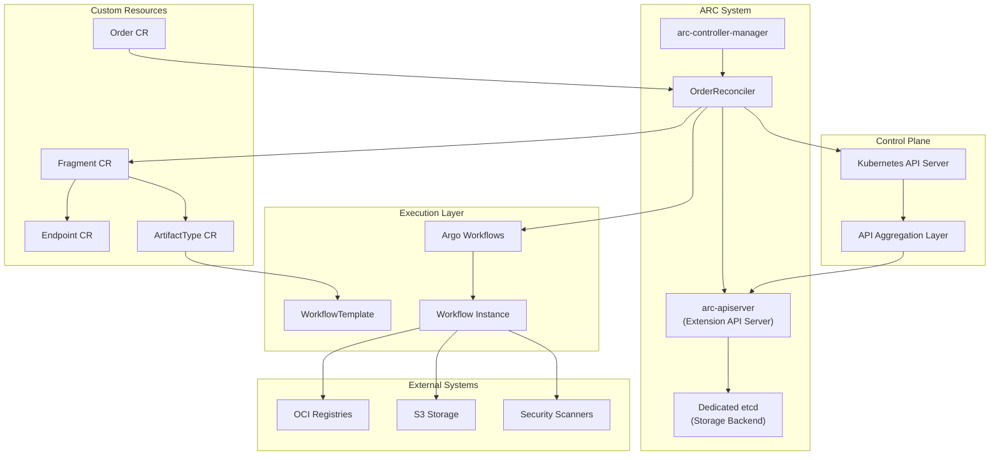
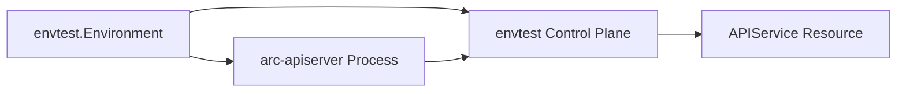
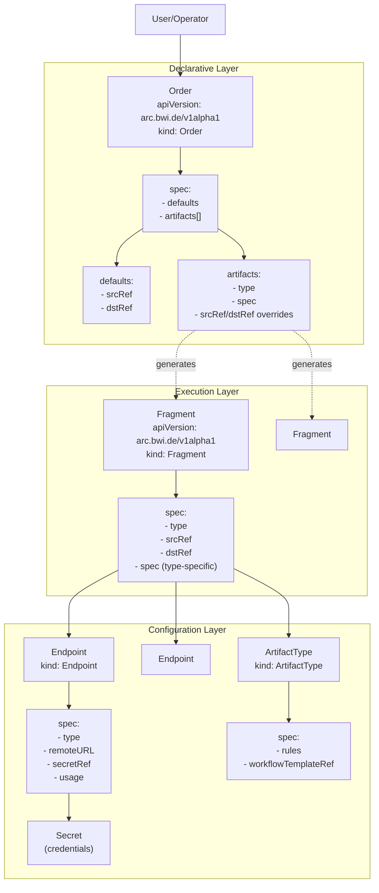
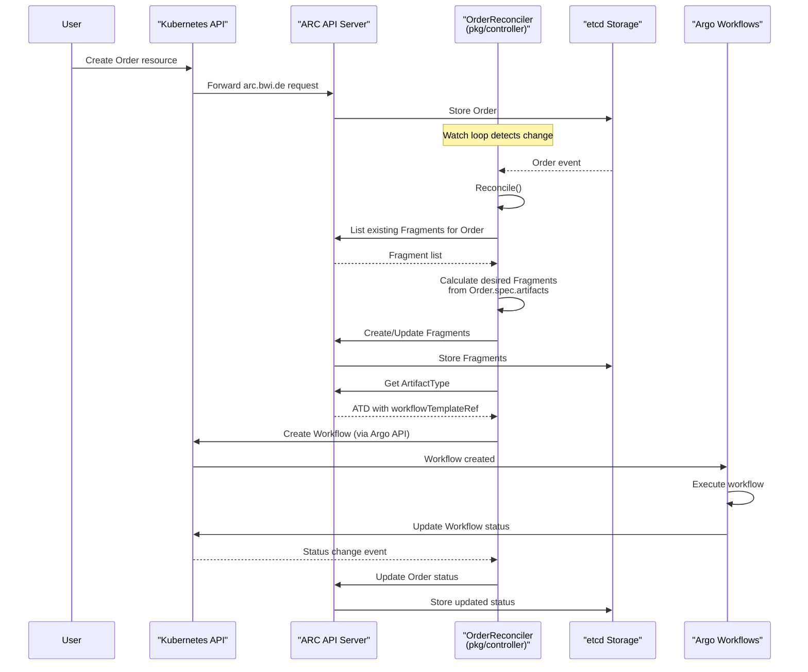
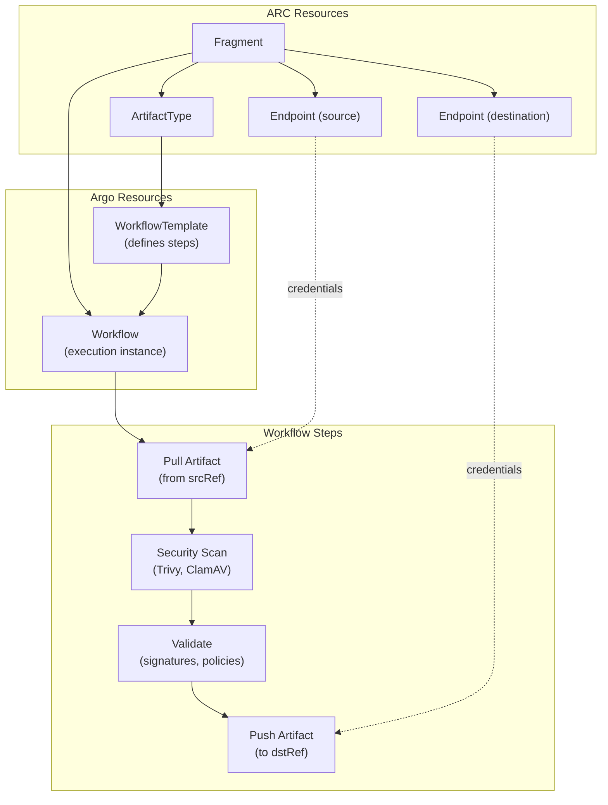
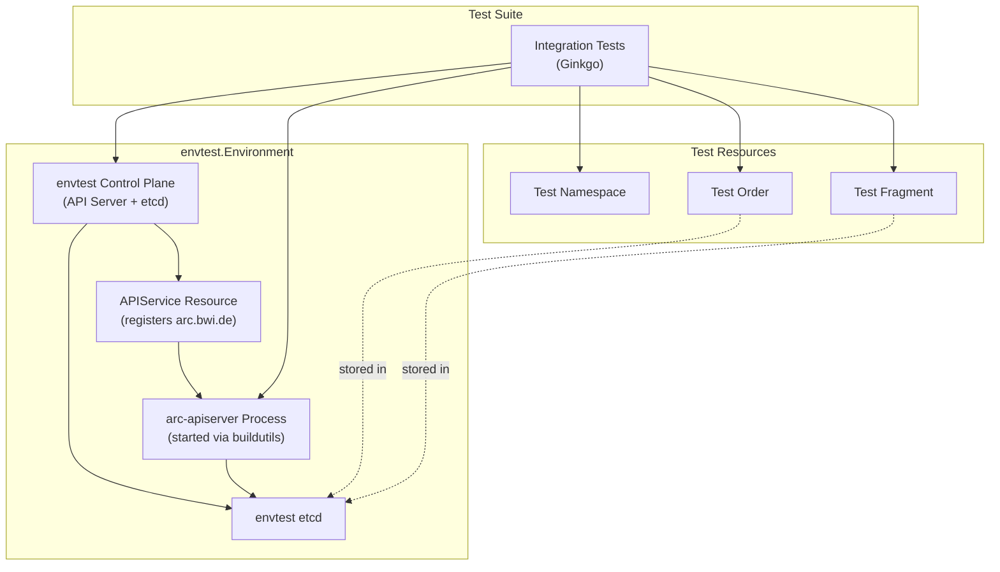
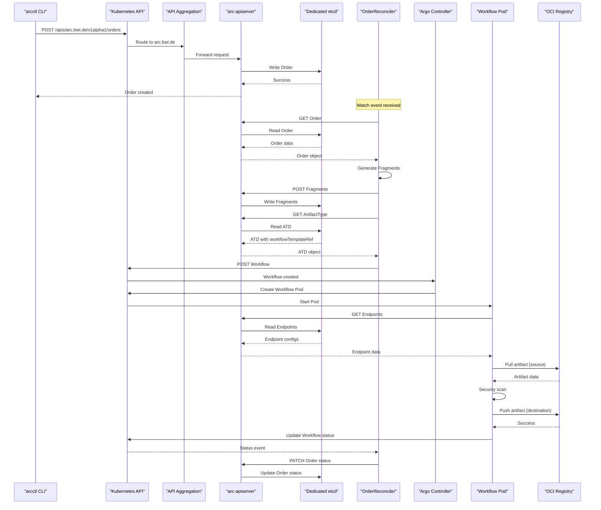

# Core Concepts

This document provides a comprehensive overview of the Artifact Conduit (ARC) system architecture, covering its design principles, core components, and how they interact.

## Purpose and Scope

ARC is a Kubernetes-native artifact management system designed to securely transport artifacts (OCI images, Helm charts, generic files) across network boundaries, particularly into air-gapped environments. The architecture employs a Kubernetes Extension API Server pattern to provide declarative resource management while maintaining flexibility for future storage backend changes.

## Architectural Decision

ARC's architecture is based on **Architectural Decision Record 001**, which selected an Extension API Server approach over traditional Custom Resource Definitions (CRDs). This design provides several key advantages:

| Aspect                | Decision                         | Rationale                                                                   |
| --------------------- | -------------------------------- | --------------------------------------------------------------------------- |
| **API Extension**     | Kubernetes API Aggregation Layer | Allows dedicated etcd instance, avoiding cluster control plane pollution    |
| **Storage Backend**   | Dedicated etcd (replaceable)     | Enables future migration to alternative storage if needed                   |
| **Workflow Engine**   | Argo Workflows                   | Leverages proven workflow orchestration without reinventing execution logic |
| **Declarative Model** | Kubernetes-style resources       | Maintains familiar kubectl/GitOps patterns for users                        |

The Extension API Server pattern allows ARC to present a Kubernetes-native API surface while maintaining complete control over storage implementation and API behavior.

## System Components

### Component Overview

### ARC API Server

The API Server implements the Kubernetes Extension API Server pattern, registering with the Kubernetes API Aggregation Layer to handle requests for the `arc.bwi.de` API group.

**Key Characteristics:**

| Property         | Value                   |
| ---------------- | ----------------------- |
| **Package**      | `pkg/apiserver/`        |
| **API Group**    | `arc.bwi.de/v1alpha1`   |
| **Storage**      | Dedicated etcd cluster  |
| **Registration** | Via APIService resource |

The API Server is built using `apiserver-runtime` and `sample-apiserver` patterns, providing:

- Native Kubernetes authentication and authorization integration
- OpenAPI schema generation
- Support for standard Kubernetes API conventions (List, Watch, Get, Create, Update, Delete, Patch)
- Server-side apply functionality

The test environment bootstraps the API Server programmatically for integration testing:

### Controller Manager

The controller manager binary (`arc-controller-manager`) hosts the Order controller and other reconciliation loops.

**Binary Location:** [cmd/arc-controller-manager/main.go:1-196]()

**Configuration:**

| Flag                          | Default | Purpose                       |
| ----------------------------- | ------- | ----------------------------- |
| `--metrics-bind-address`      | `0`     | Metrics endpoint address      |
| `--health-probe-bind-address` | `:8081` | Health check endpoint         |
| `--leader-elect`              | `false` | Enable leader election for HA |
| `--metrics-secure`            | `true`  | Serve metrics over HTTPS      |

The manager initializes with:

- Kubernetes client-go scheme + ARC custom resources ([cmd/arc-controller-manager/main.go:37-40]())
- Controller-runtime manager with leader election support ([cmd/arc-controller-manager/main.go:150-162]())
- OrderReconciler registration ([cmd/arc-controller-manager/main.go:173-178]())
- Health and readiness checks ([cmd/arc-controller-manager/main.go:182-189]())

## Resource Model

### Resource Hierarchy

### Resource Definitions

#### Order

High-level declarative resource specifying one or more artifacts to process.

**API Structure:**

- **Group:** `arc.bwi.de`
- **Version:** `v1alpha1`
- **Kind:** `Order`
- **Spec Fields:**
  - `defaults`: Default source and destination endpoints
  - `artifacts`: Array of artifact specifications

#### Fragment

Represents a single artifact operation, generated from Order resources by the Order controller.

**Generation Logic:**
The OrderReconciler decomposes an Order into individual Fragments, applying defaults from the Order spec to each Fragment that doesn't specify its own `srcRef` or `dstRef`.

#### Endpoint

Defines connection details for artifact sources and destinations.

**Spec Fields:**

- `type`: Endpoint type (e.g., `oci`, `s3`, `helm`)
- `remoteURL`: Connection URL
- `secretRef`: Reference to Secret containing credentials
- `usage`: Enum (`PullOnly`, `PushOnly`, `All`)

#### ArtifactType

Defines processing rules and workflow templates for specific artifact types.

**Spec Fields:**

- `rules`: Validation rules for source and destination endpoint types
- `defaults`: Default endpoint references
- `workflowTemplateRef`: Reference to Argo WorkflowTemplate

## Controller Architecture

### Order Reconciliation Flow

The OrderReconciler implements the controller-runtime `Reconciler` interface and is registered in the controller manager.

**Reconciliation Logic:**

1. Fetch Order resource
2. Generate Fragment specifications from `Order.spec.artifacts`
3. Apply defaults from `Order.spec.defaults` to Fragments
4. Create/update Fragment resources via ARC API Server
5. Lookup ArtifactType for each Fragment type
6. Create Argo Workflow instances using WorkflowTemplate from ATD
7. Update Order status based on Fragment and Workflow states

## Storage Architecture

### Dedicated etcd Instance

Unlike CRD-based solutions that share the cluster's etcd, ARC uses a dedicated etcd cluster. This architectural choice provides:

| Benefit         | Description                                               |
| --------------- | --------------------------------------------------------- |
| **Isolation**   | ARC resource storage doesn't impact cluster control plane |
| **Scalability** | Independent scaling for high artifact throughput          |
| **Flexibility** | Storage backend can be replaced without API changes       |
| **Performance** | Optimized storage parameters for ARC's access patterns    |

The API Server connects to etcd using standard etcd v3 client configuration. In the test environment, this is provided by envtest's embedded etcd:

[pkg/envtest/environment.go:56]() - The API Server is configured with etcd servers from the test environment's control plane.

## Workflow Integration

### Argo Workflows Execution Model

ARC delegates actual artifact processing to Argo Workflows, which provides:

- DAG-based workflow execution
- Container-native artifact handling
- Retry and failure handling
- Status reporting

**Workflow Creation:**
The OrderReconciler creates Workflow instances by:

1. Reading the `workflowTemplateRef` from the ArtifactType
2. Instantiating a Workflow from the template
3. Passing Fragment metadata and Endpoint references as workflow parameters
4. Submitting the Workflow to Argo via Kubernetes API

**Status Propagation:**
Workflow status changes are watched by the OrderReconciler and propagated to Fragment and Order status fields.

## Testing Infrastructure

### Test Environment Architecture

The test environment (`pkg/envtest/environment.go`) provides a complete ARC deployment for integration testing:

**Initialization:** [pkg/envtest/environment.go:30-40]()

- Creates envtest Kubernetes environment with APIService definitions
- Starts arc-apiserver binary via buildutils
- Configures API Server to use envtest etcd
- Waits for APIService readiness

**Test Setup:** [pkg/apiserver/suite_test.go:67-83]()

- Creates isolated test namespaces per test case
- Provides Kubernetes client configured for ARC resources
- Automatic cleanup on test completion

**Sources:** [pkg/envtest/environment.go:1-93](), [pkg/apiserver/suite_test.go:1-84]()

## Component Interactions

### Request Flow for Artifact Processing

This sequence shows the complete lifecycle from user command to artifact delivery, highlighting the separation between declarative resource management (ARC API Server) and execution (Argo Workflows).

## Design Principles

### Separation of Concerns

| Layer                   | Responsibility                      | Implementation          |
| ----------------------- | ----------------------------------- | ----------------------- |
| **API Layer**           | Resource CRUD, validation, storage  | arc-apiserver + etcd    |
| **Control Layer**       | Reconciliation, Fragment generation | OrderReconciler         |
| **Execution Layer**     | Artifact processing, scanning       | Argo Workflows          |
| **Configuration Layer** | Endpoint definitions, type rules    | Endpoint, ATD resources |

### Declarative vs. Imperative

ARC follows Kubernetes conventions:

- **Declarative:** Users create Order resources describing desired artifacts
- **Reconciliation:** Controllers continuously reconcile actual state toward desired state
- **Status Reporting:** Status fields reflect current state and progress

### Extension API Server Benefits

The Extension API Server pattern provides:

1. **Future-Proof Storage:** etcd can be replaced with alternative storage without changing the API
2. **Performance Isolation:** High-volume artifact operations don't impact cluster control plane
3. **Custom Behavior:** Full control over API semantics, validation, and storage strategies
4. **Standard Tooling:** Compatible with kubectl, client-go, and GitOps tools

**Trade-offs:**

- More complex deployment (requires APIService registration)
- Steeper learning curve for contributors
- Additional operational considerations (etcd management)

## Summary

ARC's architecture achieves Kubernetes-native artifact management through:

1. **Extension API Server:** Provides declarative resource model with flexible storage backend
2. **Controller Pattern:** OrderReconciler decomposes high-level Orders into executable Fragments
3. **Argo Integration:** Leverages proven workflow engine for artifact processing
4. **Dedicated Storage:** Isolated etcd prevents impact on cluster control plane
5. **Resource Model:** Clean separation between configuration (Endpoint, ATD) and operations (Order, Fragment)
