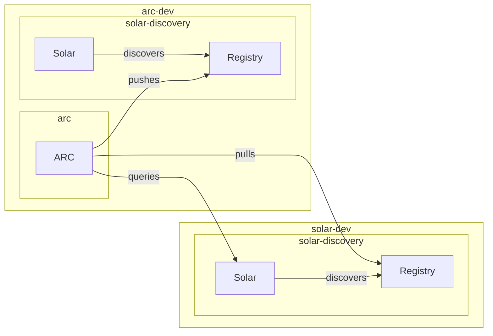

# Catalog Chaining Scenario

This walkthrough sets up a pipeline to discover and transfer components across
**two kind clusters**: `solar-dev` and `arc-dev`. The workflow runs in
`arc-dev` and uses an external kubeconfig to query Solar Resources from `solar-dev`.

Another instance of Solar running in the `arc-dev` cluster can then discover
the transferred components. This effectively allows to chain/mirror solar
catalogs across multiple clusters.

## Prerequisites

### Setting up solar-dev cluster

```bash
cd solar  # github.com/opendefensecloud/solution-arsenal
make dev-cluster

# Push some ocm components to the discovery registry
kubectl port-forward -n zot svc/zot-discovery 5000:443 &
ocm transfer ...
```

### Setting up arc-dev cluster

```bash
cd arc  # github.com/opendefensecloud/artifact-conduit
make dev-cluster
```

## Step 1: Create the ClusterWorkflowTemplate and RBAC in arc-dev

The template and RBAC must be installed in the cluster where Argo runs:

```bash
kubectl --context kind-arc-dev apply -f ./examples/solar/rbac-arc.yaml
kubectl --context kind-arc-dev apply -f ./examples/solar/cluster-workflow-template.yaml
kubectl --context kind-arc-dev apply -f ./examples/ocm/artifact-type.yaml
kubectl --context kind-arc-dev apply -f ./examples/ocm/cluster-workflow-template.yaml
```

## Step 2: Create external kubeconfig secret in arc-dev

Get the solar-dev control-plane IP:

```bash
SOLAR_IP=$(docker inspect solar-dev-control-plane -f '{{.NetworkSettings.Networks.kind.IPAddress}}')
```

Apply the Solar-specific RBAC to `solar-dev` — this creates the `ServiceAccount`,
`ClusterRole`, `ClusterRoleBinding`, and token `Secret`:

```bash
kubectl --context kind-solar-dev apply -f ./examples/solar/rbac-solar.yaml
```

Wait for the token to be populated, then retrieve it:

```bash
TOKEN=$(kubectl --context kind-solar-dev \
  get secret catalog-chaining-access-token -n default \
  -o jsonpath='{.data.token}' | base64 -d)
```

Get the solar-dev CA certificate from the control-plane node (the host
kubeconfig uses a different cert):

```bash
SOLAR_CA=$(docker exec solar-dev-control-plane cat /etc/kubernetes/pki/ca.crt | base64 -w0)
```

Build the kubeconfig and create it as a Secret in `arc-dev`:

```bash
cat > /tmp/solar-dev-kubeconfig.yaml <<EOF
apiVersion: v1
kind: Config
current-context: solar-dev
clusters:
- cluster:
    certificate-authority-data: $SOLAR_CA
    server: https://$SOLAR_IP:6443
  name: solar-dev
contexts:
- context:
    cluster: solar-dev
    user: catalog-chaining-access
  name: solar-dev
users:
- name: catalog-chaining-access
  user:
    token: $TOKEN
EOF

kubectl --context kind-arc-dev create secret generic solar-dev-kubeconfig \
  --from-file=kubeconfig=/tmp/solar-dev-kubeconfig.yaml \
  -o yaml --dry-run=client | kubectl --context kind-arc-dev apply -f -
```

## Step 3: Expose zot-discovery via NodePort (solar-dev)

The workflow pods in `arc-dev` need to reach the zot-discovery registry. Create
a NodePort `Service` in `solar-dev`:

```bash
cat > /tmp/zot-nodeport.yaml <<EOF
apiVersion: v1
kind: Service
metadata:
  name: zot-discovery-nodeport
  namespace: zot
spec:
  type: NodePort
  ports:
    - port: 443
      targetPort: 5000
      nodePort: 30444
  selector:
    app.kubernetes.io/instance: zot-discovery
    app.kubernetes.io/name: zot
EOF

kubectl --context kind-solar-dev apply -f /tmp/zot-nodeport.yaml
```

The zot-discovery TLS cert must include the NodePort IP (`$SOLAR_IP`) as a SAN,
otherwise workflow pods will get TLS errors:

```bash
kubectl --context kind-solar-dev patch certificate zot-tls -n zot --type merge \
  -p='{"spec":{"ipAddresses":["10.96.200.10","'"$SOLAR_IP"'"]}}'

kubectl --context kind-solar-dev wait --for=condition=Ready certificate zot-tls -n zot --timeout=30s
```

Restart the Zot pod to pick up the new certificate:

```bash
kubectl --context kind-solar-dev rollout restart -n zot sts/zot-discovery
```

## Step 4: Configure solar-discovery to use the NodePort

Create and apply the Registry resource pointing to the NodePort endpoint so
Solar discovers components at the address reachable from outside the cluster:

```bash
cat > /tmp/zot-external-scan.yaml <<EOF
apiVersion: solar.opendefense.cloud/v1alpha1
kind: Registry
metadata:
  name: zot-external-scan
  namespace: solar-system
spec:
  hostname: $SOLAR_IP:30444
  scanInterval: 10s
  solarSecretRef:
    name: zot-discovery-auth
  targetPullSecretName: regcred
EOF

kubectl --context kind-solar-dev create secret generic zot-discovery-auth -n solar-system \
    --from-literal=username=admin \
    --from-literal=password=admin \
    -o yaml --dry-run=client | kubectl --context kind-solar-dev apply -f -

kubectl --context kind-solar-dev apply -f /tmp/zot-external-scan.yaml
```

Restart the Solar discovery pod to pick up the new registry:

```bash
kubectl --context kind-solar-dev rollout restart -n solar-system deploy solar-discovery
```

Wait for the discovery to scan and create Component/ComponentVersion resources:

```bash
kubectl --context kind-solar-dev get components -A
kubectl --context kind-solar-dev get componentversions -A
```

## Step 5: Set up Zot CA trust in arc-dev

Workflow pods in `arc-dev` need to trust the self-signed CA that signed the
zot-discovery TLS certificate. Extract the CA cert and add it to the
trust-manager `root-bundle`:

```bash
ZOT_CA_PEM=$(kubectl --context kind-solar-dev \
  get secret zot-tls -n zot -o jsonpath='{.data.ca\.crt}' | base64 -d)

kubectl --context kind-arc-dev create configmap zot-ca-configmap \
  -n cert-manager --from-literal=ca.crt="$ZOT_CA_PEM" --dry-run=client -o yaml | \
  kubectl --context kind-arc-dev apply -f -
```

Update the `root-bundle` to include the Zot CA:

```bash
kubectl --context kind-arc-dev patch bundle root-bundle --type json \
  -p='[{"op":"add","path":"/spec/sources/-","value":{"configMap":{"key":"ca.crt","name":"zot-ca-configmap"}}}]'
```

Ensure the `default` namespace is labelled so it receives the updated trust bundle:

```bash
kubectl --context kind-arc-dev label ns default trust=enabled --overwrite
```

## Step 6: Install Solar in arc-dev to discover transferred components

Install a Solar instance in `arc-dev` to make components in the `dst.zot`
registry discoverable within the cluster.

The Solar discovery pod needs to trust the `dst.zot` TLS certificate, which is
signed by the `selfsigned-ca-secret` issuer already present in the
trust-manager `root-bundle`. To propagate this trust, label the Solar namespace
and enable the CA bundle mount in the discovery Helm chart.

```bash
kubectl config use-context kind-arc-dev

# Install the Solar platform (apiserver, controller-manager, etcd)
helm upgrade --install solar --namespace solar-system \
    --create-namespace oci://ghcr.io/opendefensecloud/charts/solar:0.2.1

# Create credentials for the dst.zot registry
kubectl --context kind-arc-dev create secret generic dst-secret -n solar-system \
    --from-literal=username=admin \
    --from-literal=password=admin

# Register dst.zot for scanning via the Registry CR
kubectl --context kind-arc-dev apply -n solar-system -f examples/solar/zot-registry-dst.yaml

# Label the namespace so trust-manager creates the trust bundle ConfigMap here
kubectl --context kind-arc-dev label ns solar-system trust=enabled --overwrite

# Install the discovery component with CA bundle support enabled
# so it trusts dst.zot's self-signed TLS certificate
helm upgrade --install solar-discovery oci://ghcr.io/opendefensecloud/charts/solar-discovery:0.2.1 \
    -n solar-system \
    --set caBundle.enabled=true \
    --set caBundle.configMapName=root-bundle \
    --wait

# Optionally restart discovery pod to read in Registry CR
kubectl --context kind-arc-dev rollout restart -n solar-system deploy/solar-discovery
```

## Step 7: Run the pipeline

> In a production setup there could be a `CronWorkflow` which transfers the ocm
> packages more regularly. In this prototype setup the workflow is triggered
> once by the argo-workflows cli.

Submit the workflow from `arc-dev` with a set of parameters describing the
setup.

```bash
kubectl config use-context kind-arc-dev

# create secrets
kubectl --context kind-arc-dev create secret generic src-reg-secret \
    --from-literal=username=admin \
    --from-literal=password=admin

kubectl --context kind-arc-dev create secret generic dst-reg-secret \
    --from-literal=username=admin \
    --from-literal=password=admin

argo submit --from clusterworkflowtemplate/solar-catalog-transfer \
    -p srcSecret="true" \
    -p srcSecretName="src-reg-secret" \
    -p dstSecret="true" \
    -p dstSecretName="dst-reg-secret" \
    -p dstRemoteURL="dst.zot:443" \
    -p dstScheme="https" \
    -p kubeconfigSecret="solar-dev-kubeconfig" \
    --watch
```

The workflow will:
1. Query the external cluster for Solar Resources using the mounted kubeconfig
2. Join Components with ComponentVersions and output a JSON `cv-list`
3. Submit an `ArtifactWorkflow` for each item in the list

When `--watch` completes, check the created ArtifactWorkflows and verify the
components were pushed to the destination registry:

```bash
kubectl --context kind-arc-dev get artifactworkflows.arc.opendefense.cloud \
  -l solar.opendefense.cloud/component
```

Solar discovery will discover the transferred ocm packages and create Component
and ComponentVersions Resources for them:

```bash
kubectl get components -A
kubectl get componentversions -A
```

# Wrapping up

We created 2 clusters `solar-dev` and `arc-dev`.

We pushed ocm packages to a registry in `solar-dev` and had the Solar instance
there discover them.

We used ARC in the `arc-dev` cluster to scan and transfer the components from
the registry in `solar-dev` to the one in `arc-dev`.

We used Solar in the `arc-dev` cluster to discover the transferred ocm
packages.

We can observe that the `Components` and `ComponentVersions` from the
`solar-dev` cluster are also present in the `arc-dev` cluster.


